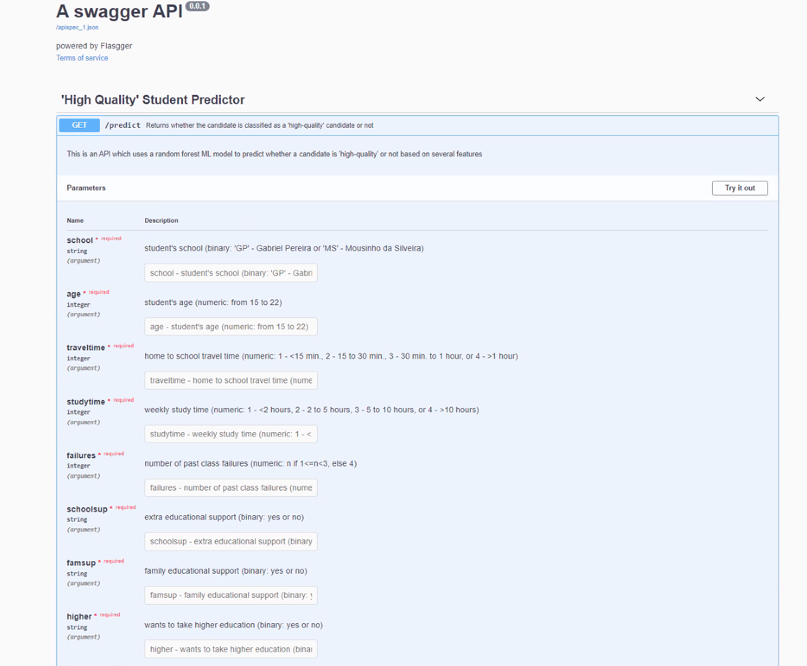
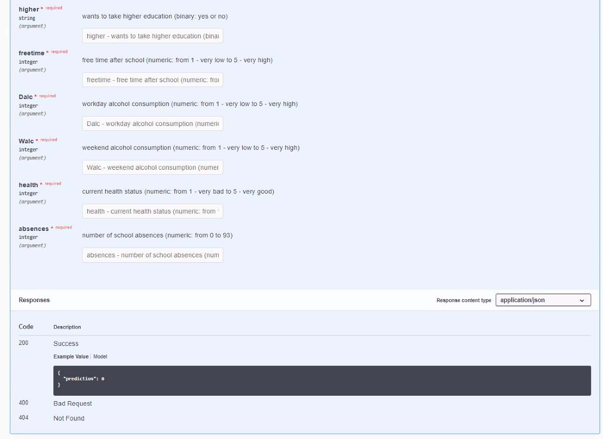

# Software Engineering for Machine Learning Assignment

## API Documentation ##

<h3> The expected inputs are the following: </h3>

school - a student’s school (binary: either ‘GP’ or “MS’)

* Schools can have different grading systems or different standards of education, which can cause average numeric scores to differ

age - a student’s age (number from 15 to 22)
* A student’s ability to learn develops as they get older, which could affect how well they learn in school and perform on tests.

traveltime - home to school travel time (numeric: 1 - <15 min., 2 - 15 to 30 min., 3 - 30 min. to 1 hour, or 4 - >1 hour)
* The time spent traveling to school can impact things like the amount of sleep a student gets, the amount of time they have to study/do homework at home, etc, which can all impact how a student performs in school.

studytime - weekly study time (numeric: 1 - <2 hours, 2 - 2 to 5 hours, 3 - 5 to 10 hours, or 4 - >10 hours)

* The study time is a strong indicator of the student’s academic success because we believe that a student who spends more time studying will likely have a better grade

failures - number of past class failures (numeric: n if 1<=n<3, else 4)

* If a student has failed classes previously, they usually do not perform as well as their non-failing peers

schoolsup - extra educational support (binary: yes or no)

* If a school offers extra educational support, students are most likely to get better scores

famsup - family educational support (binary: yes or no)

* If a family provides educational support, students are most likely to get better scores

higher - wants to take higher education (binary: yes or no)

* If a student wants to pursue higher education, they are more likely to have higher aspirations in school and to earn better grades

freetime - free time after school (numeric: from 1 - very low to 5 - very high)

* If a student has more freetime, they can spend that extra time studying, which will translate into better test scores.

Dalc - workday alcohol consumption (numeric: from 1 - very low to 5 - very high)

* If a student consumes alcohol during the workday, they are less likely to focus on school work which will impact their grades negatively

Walc - weekend alcohol consumption (numeric: from 1 - very low to 5 - very high)

* If a student consumes alcohol during the workday, they are less likely to focus on school work which will impact their grades negatively

health - current health status (numeric: from 1 - very bad to 5 - very good)

* If a student has better health, they can put in more energy to studying and doing school work, which will translate into better test scores.

absences - number of school absences (numeric: from 0 to 93)

* If a student has more absences, they will have missed more lectures and class time, which will impact their grades poorly.

<br />

The only precondition is that the data is preprocessed correctly. For example, the school has to be one of the two given.

<br />

The API should be called via an http request after it is deployed. E.g. if the service is deployed at localhost:5000, a call to API looks like this:
http://localhost:5000/predict?school=GP&age=16&traveltime=1&studytime=3&failures=0&schoolsup=yes&famsup=no&higher=yes&freetime=4&Dalc=1&Walc=1&health=3&absences=0

<br />

Once the repo is downloaded, the digital interactive API docs can be found at 
```
dockerfile/apps/apidocs
```

<br />

We have also attached screenshots below of the interactive API documentation.


<p align="center"> Top Half of API Documentation <p>


<p align="center"> Bottom Half of API Documentation <p>


---
## Model Features ##
Initially, we thought the features would be independent of each other. However, we soon realized this was not the case so we decided to rationalize about the ones to include. We started out by just looking at the preset information and adding Dalc and Walc, as we expected this information to impact the user. We ran this against the baseline model and got a slightly better F1 score, but we wanted to do better. Thus, we decided to meet as a group and rationalize which features made the most sense to add. 

Going through the list proved to be a difficult task because we had some ethical considerations to make. There were some metrics that we wanted to remove so that we diminished the bias in the data. These include sex, family size, mother/father education, mother/father job, and parental cohabitation status. 

In addition, we also wanted to remove features that we did not expect to have any impact on the student’s grades. These were somewhat arbitrary as we used our own experiences. Samples of these features include address, reason to choose school, guardian, nursery school attendance, and going out with friends metric. 
  
In the end, we decided on 13 key metrics we found to be the most important. These key metrics are school, age, traveltime, studytime, failures, schoolsup, famsup, higher, freetime, Dalc, Walc, health, and absences. Overall, these metrics gave us a very impressive number for the training and testing data. For the training data, we achieved accuracy and F1 score of 99.28% and 98.08%, respectively. For the testing data, we achieved accuracy and F1 score of 84.87% and 30.77%, respectively. This was considerably higher than the baseline F1 score of around 10%. 

---
## Deployment Instructions ##

<h3> To deploy the microservice, please follow the directions below</h3>

```
git clone https://github.com/CMU-313/fall-2021-hw4-the-brogrammers.git

cd dockerfile 

docker build -t ml:latest .

docker run -d -p 5000:5000 ml

curl http://localhost:5000/
```

If all instructions are followed properly, it should return **try the predict route it is great!**


---
## Testing Explanation ##

We performed our API testing through Github Actions by making requests to the ```/predict``` endpoints. The main goal of this testing was to ensure the endpoints are up and running and can properly accept the required inputs. In the automated Github testing, we build our docker image and start-up our microservice. We then make requests to the prediction endpoint and if those requests go through, our test passes.

For our model testing, we did it manually as we found it easier to compile average scores that way and cross-check them with previous benchmarks. We split up the data so that 70% was used for training and 30% was used for testing. We trained a random forest classifier on the training data and recorded the metrics for the model on both the training and testing data. We performed this 50 times and averaged the metrics to come up with final scores. In the end, our new model’s accuracy on test data (84.87%) was much higher than the baseline model’s accuracy (50%), 

```
name: Build and Test Microservice
on:
  push:
    branches:
      - master
  pull_request:
    branches:
      - master
  workflow_dispatch:
jobs:
  build:
    runs-on: ubuntu-latest
    steps:
    - uses: actions/checkout@v2
    - name: Build docker image
      run: docker build -t ml:latest dockerfile/
    - name: Run tests
      run: docker run -d -p 5000:5000 ml
    - name: Curl request to predict endpoint
      run: curl "http://localhost:5000/predict?school=MS&age=17&traveltime=3&failures=2&schoolsup=yes&famsup=yes&higher=no&freetime=2&dalc=2&walc=1&health=5&health=5&absences=12"

```